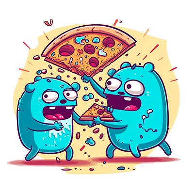

# Go Concurrency
Chuck Sailer - July 11th, 2003
<div align="center">

</div>

This repo is for understanding how ```Go``` handles concurrency.

*Concurrency* is a core feature in Go programming language. It allows multiple tasks to run independently at the same time, making the most of computing resources and improving performance in applications such as web servers, data pipelines, and more. Concurrency in Go is achieved using goroutines and channels, which provide a way to structure concurrent code that is robust, efficient, and easier to reason about compared to traditional thread-based concurrency models.

A goroutine is a lightweight thread of execution managed by the Go runtime. You can launch a goroutine simply by prefixing a function call with the go keyword. The Go runtime handles scheduling of goroutines onto operating system threads, allowing a Go application to run thousands or even millions of goroutines concurrently. Channels, on the other hand, are used to safely pass data between goroutines, synchronizing their execution and preventing data races. Together, goroutines and channels form the backbone of Go's concurrency model, enabling the development of complex concurrent programs with relative ease.

1. [Workgroups][wg]
2. [Race Conditions][rc]
3. [Mutex and Locks][mx]
4. [Channels][ch]

[wg]: 1_workgroups/README.md
[rc]: 2_race-conditions/README.md
[mx]: 3_mutex/README.md
[ch]: 4_channels/README.md